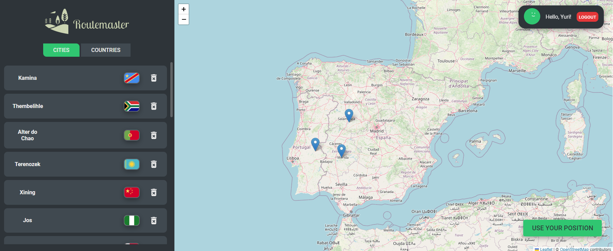

# RouteMaster

[](https://opensource.org/license/ISC)

## Table Of Content

- [Description](#description)
- [Deployed website link](#deployedWebsite)
- [Installation](#installation)
- [Usage](#usage)

- [GitHub](#github)
- [Contact](#contact)
- [License](#license)


## Description

I created this project to practice building a fully functioning full-stack web application connected to a database and a server. The application aims to assist users in organizing their travel plans, both past and future. i decided to create this application after watching "The Ultimate React Course 2024: React, Next.js, Redux & More" by Jonas Schmedtmann on Udemy. The web application was inspired by a code-along from this course. I built it from scratch after watching the code-along lessons, added my twist to it, and developed the server side from scratch."

This web application was developed using React Vite for the front end, Express for the back end, and MySQL for the database. To manage state across the application, I implemented three context files using the Context API and React's useReducer. The first context file handles all user-related processes, such as authentication, login, and logout. Registering and logging in are managed on the server side.

Upon registration or login, an API call is made from the Context API to the backend, where the "bcrypt" library is utilized for password hashing and decryption. Data is retrieved from the MySQL database connected to the backend. Additionally, "jsonwebtoken" and "cookie-parser" are employed for user verification. The expiration time of cookies is customizable, and inactive user tokens are automatically deleted, facilitating seamless logout.

For styling the front end, CSS Modules were utilized for convenience and modularity. The server side is hosted on Google Cloud, while the application itself is hosted on Render.com.

<p>Deployed website: <strong><a href="routemaster.onrender.com">routemaster.onrender.com</a></strong>

<p align="center">
  <br>
routeMaster
</p>

## Installation

Front End:

1.Install dependencies:

```jsx
npm install
```

2.Run:

```jsx
npm run dev
```

Back End:

1.Install dependencies:

```jsx
npm install

```

2.Run:
If you choose to use nodemon, `nodemon server`, otherwise run `node server`

RouteMaster is built with the following tools and libraries: <ul><li>dotenv</li> <li>express</li> <li>cors</li> <li>mysql</li> <li>bcrypt</li> <li>cookie-parser</li> <li>jsonwebtoken</li> <li>react-leaflet</li> <li>leaflet</li> <li>country-flag-icons</li> <li>react-datepicker</li> <li>react-hook-form</li> <li>react-icons</li> <li>react-router-dom</li> <li>yup</li></ul>

## Usage

It's worth noting that due to the usage of Render's free tier, web services may go to sleep after a period of inactivity. To ensure proper functionality, users may need to log in, wait for a minute, refresh the page, and return to the home page. This should restore the application's intended functionality.

The application is ready for deployment. If you want to use it locally for development, you need to make a few adjustments. First, create an .env file for both the server-side and the frontend. For example, in the frontend .env file, add `VITE_REACT_APP_SERVER_URL=http://localhost:3030`.

In the server-side .env file, include `ACCESS_TOKEN_SECRET` and `REFRESH_TOKEN_SECRET`, and specify `PORT=3030` or any other port that suits your needs.

In the server.js file, under the `//MYSQL` section, use the `//LOCAL` options for MySQL. Similarly, under the `//CORS` section, use the `//PRODUCTION` option and remove the second one.

After making these adjustments, you'll be ready to use this application for production.

I created this application using XAMPP with Apache server and MySQL, you can use this method or any other that suits your preferences.

Feel free to adjust the details according to your specific setup and requirements!

## GitHub

<a href="https://github.com/razzzaa"><strong>razzzaa</a></strong>

<p><strong><a href="https://www.youtube.com/watch?v=K22_5LBuB9Y&ab_channel=MacMiller">"If feeling overwhelmed, click here."

## Contact

Feel free to reach out to me on my email:
yurikogan194@gmail.com

## License

[](https://opensource.org/license/ISC)
